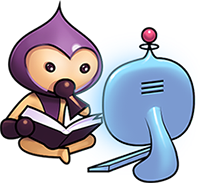

# Phaser Starter

A simple starter project to get your Phaser game up and running with ease. With Webpack, ES6 transpiling, page reloading and Github page publishing.

## Install
- Get the files
  - `git clone https://github.com/oliverbenns/phaser-starter.git`
  - **or** download a r [zip/tar.gz](https://github.com/oliverbenns/phaser-starter/releases)
- `npm install`

## Development
- `npm run develop`
- Open `http://localhost:8080`

## Build
- `npm run build`
- Javascript bundle will be in `/public/assets/bundle.js`

## Github page deployment
- `npm run deploy`
